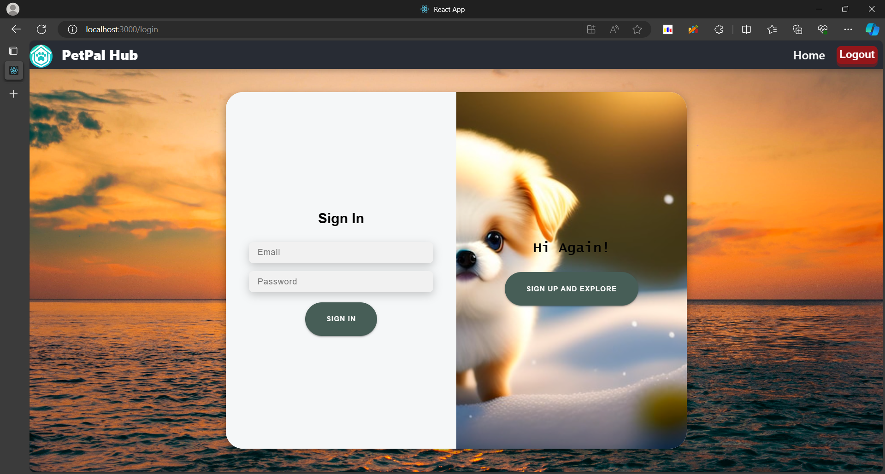

## PetPal Hub 

### A comprehensive platform for shelters, adopters, and furry friends

**PAMS** is a user-friendly software solution designed to streamline pet adoption and shelter operations. We connect animal shelters, staff, potential adopters, and pets, facilitating efficient adoptions and improving the lives of countless creatures.

### Key Features:

* **Shelter Management:**
    * Create and manage shelter profiles with details, location, and contact information.
    * Manage staff members with contact information.
* **Pet Management:**
    * Create and edit profiles for adoptable pets with detailed information like species, breed, age, health, behavior, and description.
* **Adoption Process:**
    * Prospective adopters can submit applications online and track their status.
    * Shelter staff can review applications, approve or reject them, and manage adoption records.
* **Search and Find Your Perfect Match:**
    * Visitors can search for pets based on criteria like species, breed, age, and location.
    * Filter results by attributes like house-training, vaccinations, or spaying/neutering status.
    * View detailed pet profiles with captivating images and descriptions.
* **Stay Informed and Connected:**
    * Users receive notifications for important events like application approvals.
* **Security and Privacy:**
    * Secure user accounts with authentication and authorization based on roles.
    * Data privacy compliance to safeguard user and pet information.
* **Scalable and Reliable:**
    * Flexible system architecture to accommodate shelter growth and increasing adoption numbers.
    * Secure data backups and recovery mechanisms for peace of mind.

### UI Screenshots:

**Login Page:**

**Search Page:**

**Pet Profile Page:**

**Adoption Application Page:**

**Confirmation Page:**

**Homepage:**

### Get started today!

* Clone the repository: [(https://github.com/topics/pet-adoption](https://github.com/moriyad12/PetPalHub)
  
Let's make a pawsitive difference, one adoption at a time!
